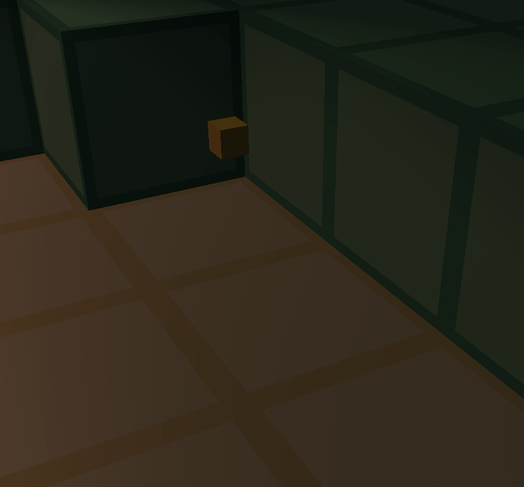

# voxel-game
Features | [File Structure](#File-Structure) | [Reviews](#Reviews) | [Credits](#Credits)

## Features


#### procedural terrain generation


#### cellular automata


#### farming


#### (WIP) multiplayer

## File Structure
```
🎮voxel_game
 ┣ 📂src
 ┃ ┣ 🔹main.cpp
 ┃ ┣ 🔸window.h
 ┃ ┣ 🔸renderer.h
 ┃ ┣ 🔸particles.h
 ┃ ┣ 🔸chunk.h
 ┃ ┣ 🔸items.h
 ┃ ┣ 🔸world.h
 ┃ ┣ 🔸gui.h
 ┃ ┗ 🔸player.h
 ┣ 📂assets
 ┃ ┣ 📂audio
 ┃ ┃ ┣🎵block.audio
 ┃ ┃ ┣🎵pop_0.audio
 ┃ ┃ ┣🎵pop_1.audio
 ┃ ┃ ┗🎵pop_2.audio
 ┃ ┣ 📂dev
 ┃ ┃ ┗⚒basic
 ┃ ┣ 📂meshes
 ┃ ┃ ┣ 📂basic
 ┃ ┃ ┃ ┣🧱cube.mesh
 ┃ ┃ ┃ ┣🧱cube.mesh_uv
 ┃ ┃ ┃ ┣🧱cylinder.mesh_uv
 ┃ ┃ ┃ ┣🧱ico.mesh
 ┃ ┃ ┃ ┣🧱plane.mesh
 ┃ ┃ ┃ ┣🧱plane.mesh_uv
 ┃ ┃ ┃ ┣🧱sphere.mesh
 ┃ ┃ ┃ ┗🧱sphere.mesh_uv
 ┃ ┃ ┣🧱block.mesh
 ┃ ┃ ┣🧱block_multi.mesh
 ┃ ┃ ┗🧱fluid.mesh
 ┃ ┣ 📂misc
 ┃ ┃ ┣📊farming.gif
 ┃ ┃ ┣📊multiplayer.gif
 ┃ ┃ ┣📊sand.gif
 ┃ ┃ ┗📊terrain_generation.gif
 ┃ ┣ 📂shaders
 ┃ ┃ ┣✏️basic.vert
 ┃ ┃ ┗✏️basic.frag
 ┃ ┗ 📂textures
 ┃    ┣🎨block_atlas.bmp
 ┃    ┣🎨icons.bmp
 ┃    ┣🎨materials.bmp
 ┃    ┣🎨multi_face.bmp
 ┃    ┗🎨palette.bmp
 ┣ 📂dependencies
 ┃ ┣ 📂external
 ┃ ┃ ┣📚GLEW
 ┃ ┃ ┣📚GLFW
 ┃ ┃ ┣📚GLM
 ┃ ┃ ┣📚OpenAL
 ┃ ┃ ┗🔸stb_image.h
 ┃ ┗ 📂proprietary
 ┃    ┣🔸boilerplate.h
 ┃    ┗🔸mathematics.h
 ┣ 📖README.txt
 ┗ ⚖️LICENSE.txt
```

## Reviews
- "nice" - my mom
- "no errors" - my compiler
- "original" - notch

## Credits
- Block textures & icons are from the extremely talented [BDcraft](https://bdcraft.net/)